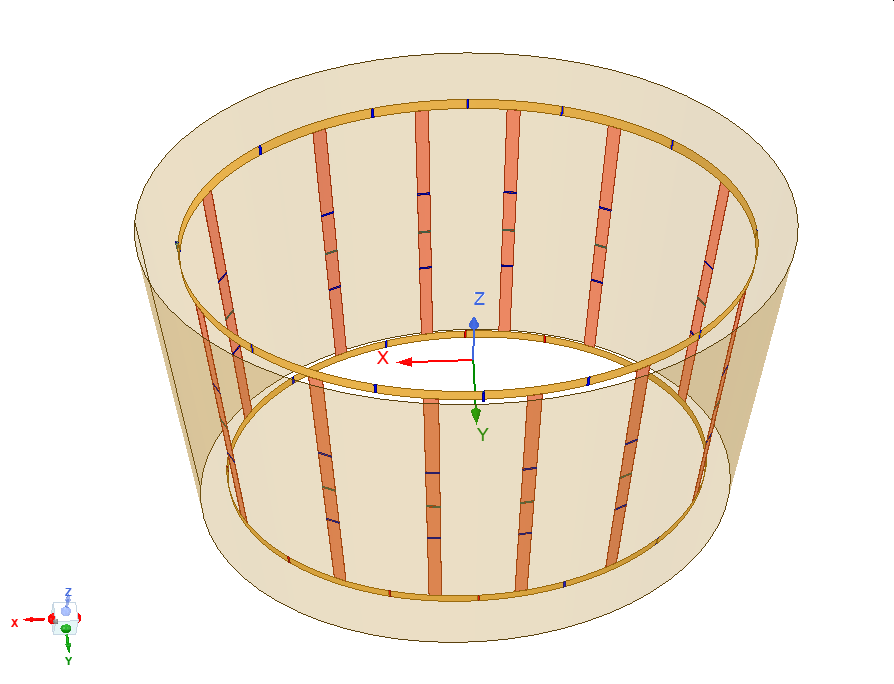
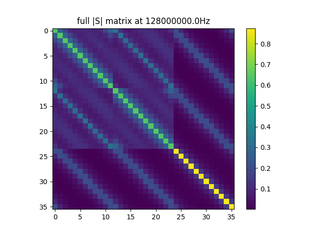
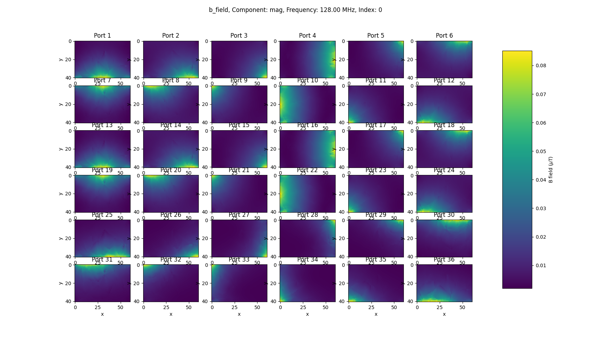
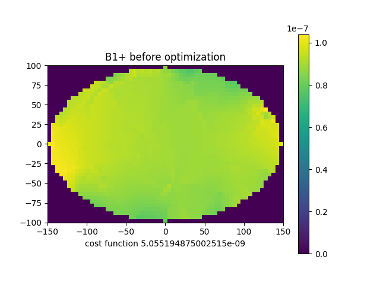
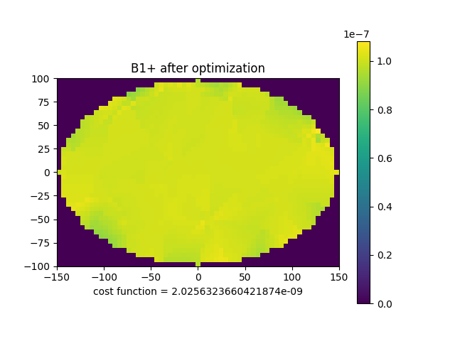
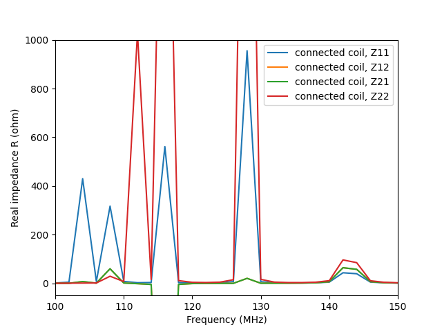
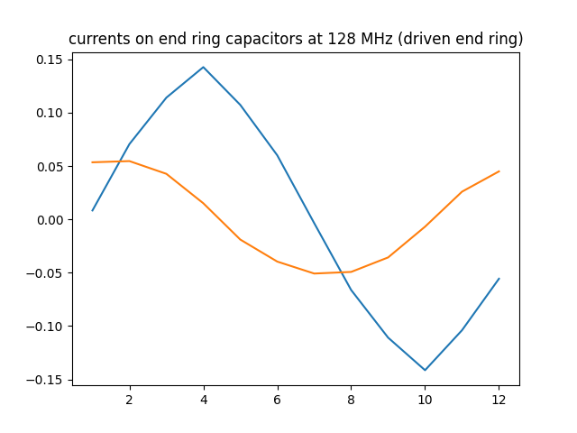

# Tuning an Elliptical MRI Birdcage Coil Using Co-simulation



## MRI and RF Coils
Magnetic resonance imaging (MRI) requires radio frequency (RF) “coils” to excite and receive the MR signal from <sup>1</sup>H nuclei (protons). Coils are similar to antennas: they must produce a desired field pattern and operate at a given frequency, which for MR is known as the Larmor frequency and is given by the product of the scanner’s static magnetic field (B<sub>0</sub> in tesla – T) and gyromagnetic ratio (γ = 42.58 MHz/T for protons) of the nuclei.

## Elliptical Birdcage Coil

Birdcage coils have become the standard for volume excitation thanks to their ability to produce highly homogeneous RF magnetic fields over large volumes. Traditional birdcage coils have a circular shape that matches the interior shape of the MRI scanner. However, in some applications it is desirable to make a birdcage coil that does not have a circular cross section, e.g., to match the shape of the human anatomy or to place the coil on top of the patient bed in the MRI scanner (instead of around both the bed and patient).
Tuning capacitors on a circular birdcage coil do not change from one section to another because of the rotational symmetry. Designing a birdcage coil on any shape that does not have the rotational symmetry of the circle is challenging because the capacitors used to tune the coil must be different from one section of the coil to the next. Without these capacitance variations around the circumference of the coil the field homogeneity can be severely degraded, and tuning the coil’s two modes to the Larmor frequency may not be possible at all.
For the elliptical shape, Leifer [1] determined that the coil rungs should be placed by mapping their positions from the circle to the ellipse using an appropriate conformal transformation. Optimal field homogeneity can then be achieved by creating the same (co)sinusoidally-distributed currents needed for the circular birdcage around the circumference. Birdcage coils are often surrounded by an RF shield which provides stable boundary conditions and a ground reference, in addition to limiting interactions with the scanner’s gradient coils. These boundary conditions, however, degrade the field homogeneity of the birdcage unless a specific shape is used, which in the case of the ellipse is another ellipse that is confocal with that on which the coil is built [2]. These concepts were subsequently generalized to other shapes [3].
None of these publications, however, describe a robust method to determine the capacitance values required for quadrature operation. The general method described in [4] assumes that the coil can be modelled as a lumped-element network, which is certainly not the case in modern high- and ultra-high-field MRI applications.

## RF Simulation and Co-simulation

Nowadays it is common to perform computer simulations of the RF electromagnetic fields generated by the coil to evaluate its performance. Several software packages are available to solve Maxwell’s equations (i.e., “full-wave” simulations) in the presence of a model of the coil that can include lumped elements (e.g., capacitors, inductors) and, often, a means of applying an excitation or “drive”.
Even with today’s computing power, simulations can take substantial time (hours to days) and computer resources (1TB of RAM or more). Therefore, tuning a non-circular birdcage by repeating the simulation to adjust one or more parameters can be tedious, if not prohibitive. Fortunately, in the case of adjustments to lumped elements there is a technique called circuit co-simulation [5], [6], [7] which takes advantage of the properties of linear networks. Co-simulation requires performing the lengthy full-wave simulation only once, and the tuning is performed in a subsequent, much faster post-processing step. Some RF simulation software packages include co-simulation capabilities. This example uses an external, open-source Python library instead ([CoSimPy](https://github.com/umbertozanovello/CoSimPy)). Unlike the full-wave simulation, the Python script can be run on modest hardware.

## Elliptical Coil Example

The coil has a hybrid topology in which one capacitor is connected in series to each longitudinal rung as well as each end-ring segment. Dimensions are listed in *Table 1*. The shield is elliptical but not confocal with the ellipse on which the coil is built. Consequently, (co)sinusoidal current distributions will not lead to optimal RF field homogeneity and they must be determined by optimization.

| Parameter and units | Value |
|---|---|
|Number of sections	|12|
|Coil length [mm]	|400|
|Coil major diameter [mm]	|517.78|
|Coil minor diameter [mm]	|332.78|
|Shield length [mm]|	460|
|Shield major diameter [mm]|	582.26|
|Shield minor diameter [mm]|	397.26|
|Width of copper strips [mm]|	12.7|
|Thickness of copper strips [mm]|	0.3|

### Tuning Objectives

The coil must operate in quadrature (circular polarization) at 128 MHz to be used in a 3 tesla MRI scanner and the RF magnetic field homogeneity must be similar to that of a comparable circular coil. Given the 3 planes of symmetry in this coil (XY, XZ, and YZ), of the 3 × 12 = 36 capacitors in the network only 7 unique values are needed, and the rest are obtained by mirror symmetry (note also that a hybrid circular coil requires only two distinct capacitor values).

### Full-wave simulation

The coil was [modelled in Ansys HFSS](Elliptical_Birdcage_Coil_36ports.aedt) 2022R1 with the dimensions provided in Table 1. A lumped excitation port (50  characteristic impedance) was placed across each gap that will eventually host a capacitor in the network (36 ports in total). The simulation setup was a discrete frequency sweep from 100 MHz to 150 MHz in 2 MHz steps. A [touchstone file](Elliptical_Birdcage_Coil_36ports.s36p) containing the 36×36 S matrix ([*.s36p](Elliptical_Birdcage_Coil_36ports.s36p)) for each of these frequencies was exported and is shown below.



Fields were exported for the solution at 128 MHz using a dedicated [VBS script](save_all_fields.vbs), creating one file for each port. Each field contains the H field (complex 3D vector) produced in a 300 × 200 mm2 rectangular region of the central transverse plane of the coil when the corresponding port is excited by 1W of incident power and the remaining ports are matched and not excited. The script was created using the “Tools > Record Script to File” dialog to record the actions needed to export the field from one port. A FOR loop is then added to cycle through all 36 ports by updating the vector of excitation powers with appropriate values.



### Co-simulation

The Python [script](optimize_Elliptical_Birdcage_Coil_128MHz.py) begins by importing the [touchstone file](Elliptical_Birdcage_Coil_36ports.s36p) and [fields](Coil_fields) using the appropriate functions included in the [CoSimPy](https://github.com/umbertozanovello/CoSimPy) package, then creating an RF_Coil object. The 7 distinct capacitance values are initialized along with the corresponding S parameters. Scattering matrices are also created for the two excitation ports which are located across the tuning capacitors on one end ring at the 12 and 3 o’clock positions. Scattering parameters or matrices for capacitors and ports are compiled in a list of 36 elements, each corresponding to one of the 36 ports in the simulation. The ```singlePortConnRFcoil``` method then takes the list and original ```RF_Coil``` object to create a new one corresponding to the birdcage coil populated by capacitors, with 2 connection ports. The ```em_field.b_field``` method provides the resulting RF magnetic field and the ```s_matrix.S``` method creates the S matrix seen from the two ports.



### Capacitor Optimization

With the above information a cost function is readily created as the sum of a field homogeneity term and a resonant frequency term. The homogeneity term is the standard deviation of B<sub>1</sub><sup>+</sup> within an ellipse inscribed in the 300 × 200 mm<sup>2</sup> rectangular region over which the fields are exported. The resonant frequency term equals 100 × the RSS of the imaginary parts of the admittances seen at the coil’s two ports at 128 MHz. A simple local optimization algorithm (Nelder-Mead) was used because a good initial guess for the capacitances was available. More sophisticated algorithms like the genetic algorithm can be used if a more thorough search of the parameter space is required.


### Results

The optimization requires around 50 iterations and only a few seconds on a modern workstation. The resulting capacitance values and B<sub>1</sub><sup>+</sup> field magnitude plot are provided in the following table and figure, respectively.

| Capacitor number | Capacitance [pF] |
|---|---|
|C1	| 23.8|
|C2	| 21.6|
|C3	| 16.8|
|C4	| 15.2|
|Cleg1	| 16.6|
|Cleg2	| 13.3|
|Cleg3	| 11.0|



Impedances seen from the coil ports (across end ring capacitors 1 and 4) are shown in the following figure, where resonances at 128 MHz are clearly visible.



Currents in the end ring capacitors at resonance are displayed below. The approximately (co)sinusoidal patterns confirm that these resonances are the correct modes, while highlighting the fact that deviations from the (co)sinusoidal patterns are necessary to achieve a homogeneous field with this geometry.


